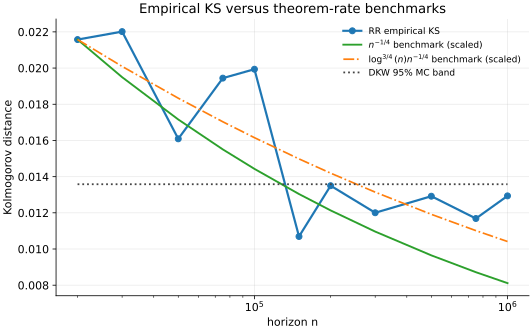
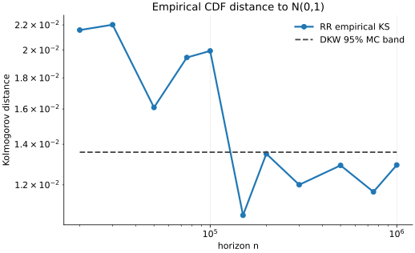
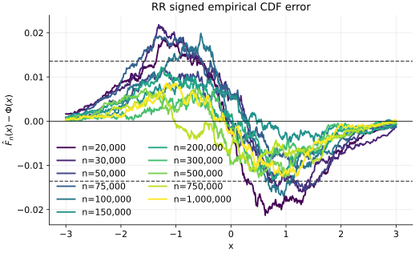
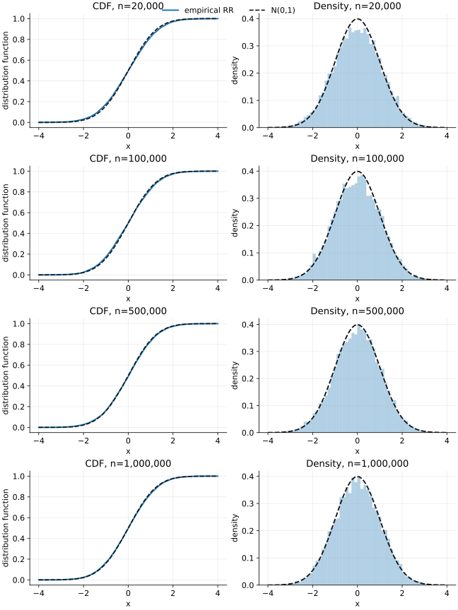

# Dense RR CDF Experiment With Theorem-Rate Benchmarks

**Date:** 2026-06-02  
**Machine:** `beleriand`  
**Scripts:**

- `code/run_rr_cdf_experiment.py`
- `code/plot_rr_cdf_experiment.py`

**Raw outputs:**

- `code/results/cdf/rr_cdf_dense_M10000_T20k_1M_summary.csv`
- `code/results/cdf/rr_cdf_dense_M10000_T20k_1M_grid.csv`
- `code/results/cdf/rr_cdf_dense_M10000_T20k_1M_z.csv`
- `code/results/cdf/rr_cdf_dense_M10000_T20k_1M_w24.log`

**Figures:**

- `figures/experiments/rr_cdf_dense_ks_distance.svg`
- `figures/experiments/rr_cdf_dense_theory_proxy.svg`
- `figures/experiments/rr_cdf_dense_theory_proxy_linear.svg`
- `figures/experiments/rr_cdf_dense_error_by_n.svg`
- `figures/experiments/rr_cdf_dense_cdf_density_selected_n.svg`

## Goal

This run checks whether the empirical Kolmogorov distance for the normalized
Richardson--Romberg statistic behaves consistently with the balanced-scale
theorem rate from the thesis.  Since the theorem contains an unknown constant,
the experiment compares shapes rather than absolute constants.

The tested statistic is

$$
Z_n^{\mathrm{RR}}(u)
  =
  \frac{
    \sqrt n\,u^\top
    \left(\bar\theta_{n,n_0}^{\mathrm{RR},\alpha_n}-\theta^\star\right)
  }{
    \sqrt{u^\top\Sigma_\infty u}
  },
\qquad
\alpha_n = 20 n^{-1/2},
$$

where

$$
\bar\theta_{n,n_0}^{\mathrm{RR},\alpha_n}
  =
  2\bar\theta_{n,n_0}^{(\alpha_n)}
  -
  \bar\theta_{n,n_0}^{(2\alpha_n)}.
$$

The empirical target is

$$
\widehat D_n
  =
  \sup_x |\widehat F_n(x)-\Phi(x)|.
$$

## Experiment Parameters

| Quantity | Value |
|---|---|
| Problem class | Finite-state Markovian linear stochastic approximation |
| Problem seed | `42` |
| Number of states | `10` |
| Parameter dimension | `d = 5` |
| Problem generation | `eig_min = 0.25`, `eig_max = 0.60`, `noise_target = 0.35`, `A_norm` cap `1.0` |
| Initial parameter | \(\theta_0=0\) for both RR branches |
| Markov-chain initial state | Fixed state `0` |
| Projection direction | One fixed random unit vector generated from `problem_seed = 42` |
| Oracle variance | Analytic finite-state \(\sigma^2(u)=u^\top\Sigma_\infty u\) |
| \(\sigma^2(u)\) value | `1.6538687545395099` |
| Stability proxy for burn-in | `a_proxy = 0.286191` |
| Trajectories per horizon | `M = 10000` |
| Horizons | `n in {20000, 30000, 50000, 75000, 100000, 150000, 200000, 300000, 500000, 750000, 1000000}` |
| Step-size schedule | \(\alpha_n = 20 n^{-1/2}\) |
| RR pair | \((2\alpha_n,\alpha_n)\), run on the same Markov trajectory |
| Burn-in rule | \(n_0=\lfloor(\alpha_n a_{\mathrm{proxy}})^{-1}\log^2 n\rfloor\) |
| Burn-in cap | `0.25 n`; not active on this grid |
| CDF grid | `801` equally spaced points on `[-3, 3]` |
| Plotted statistic | RR only |
| Workers | `24` |
| Chunk size | `250` trajectories per worker task |
| Runtime | `2312 s` |

The 95% DKW Monte Carlo floor for \(M=10000\) is

$$
\varepsilon_M
  =
  \sqrt{\frac{\log(2/0.05)}{2M}}
  =
  0.01358.
$$

## Rate Benchmarks

The thesis theorem gives the balanced-scale envelope

$$
d_K\!\left(Z_n^{\mathrm{RR}}(u),N(0,1)\right)
  \le C(u,c,\theta_0)\,\mathrm{polylog}(n)\,n^{-1/4}.
$$

The figures compare the empirical KS distance with two scaled benchmarks:

$$
B_1(n)
  =
  \widehat D_{20000}^{\mathrm{RR}}
  \left(\frac{n}{20000}\right)^{-1/4},
$$

and

$$
B_2(n)
  =
  \widehat D_{20000}^{\mathrm{RR}}\,
  \frac{\log^{3/4}(n)n^{-1/4}}
       {\log^{3/4}(20000)\,20000^{-1/4}}.
$$

These curves use only the first RR KS point as a vertical normalization.

The same comparison on a linear vertical scale is easier to read because the
empirical KS values are already close to the Monte Carlo floor.

## RR Results

| n | alpha | n0 | KS D | KS minus DKW | mean Z | var Z | coverage 95 |
|---:|---:|---:|---:|---:|---:|---:|---:|
| 20 000 | 0.14142 | 2 423 | 0.02158 | 0.00799 | 0.0035 | 1.1493 | 93.46% |
| 30 000 | 0.11547 | 3 215 | 0.02202 | 0.00843 | -0.0101 | 1.1452 | 93.48% |
| 50 000 | 0.08944 | 4 573 | 0.01609 | 0.00251 | 0.0049 | 1.1044 | 93.94% |
| 75 000 | 0.07303 | 6 028 | 0.01944 | 0.00586 | -0.0207 | 1.1107 | 93.67% |
| 100 000 | 0.06325 | 7 322 | 0.01994 | 0.00636 | -0.0032 | 1.1034 | 94.11% |
| 150 000 | 0.05164 | 9 611 | 0.01069 | 0.00000 | -0.0127 | 1.0514 | 94.55% |
| 200 000 | 0.04472 | 11 640 | 0.01350 | 0.00000 | -0.0016 | 1.0791 | 94.28% |
| 300 000 | 0.03651 | 15 219 | 0.01200 | 0.00000 | 0.0062 | 1.0398 | 94.73% |
| 500 000 | 0.02828 | 21 272 | 0.01292 | 0.00000 | 0.0084 | 1.0684 | 94.15% |
| 750 000 | 0.02309 | 27 688 | 0.01169 | 0.00000 | 0.0134 | 1.0480 | 94.37% |
| 1 000 000 | 0.02000 | 33 346 | 0.01294 | 0.00000 | 0.0060 | 1.0537 | 94.75% |

## CDF And Density Diagnostics

The signed CDF error remains small for RR and is mostly inside the Monte Carlo
resolution for larger horizons.

The following panel compares empirical RR CDFs and densities with the standard
normal at selected horizons \(n=20000,100000,500000,1000000\).

## Interpretation

The dense grid supports the qualitative theorem statement.  From about
\(n=150000\) onward, the RR KS distance is at or below the DKW Monte Carlo
floor, so the empirical curve is dominated by finite-\(M\) CDF noise.  The
visible non-monotonicity around `75k`--`100k` and `500k`--`1M` should therefore
not be interpreted as a failure of the theorem rate.

The benchmark plot is a shape comparison.  The empirical RR KS values fall to
the same scale as the \(n^{-1/4}\)-type benchmarks and then become hard to
resolve because the experiment has only \(M=10000\) trajectories per horizon.

## Takeaway

The empirical CDF experiment is consistent with the thesis formula at the
level it can be tested: RR quickly reaches the Monte Carlo CDF resolution, and
the observed KS distances are compatible with the balanced-scale
\(\mathrm{polylog}(n)n^{-1/4}\) theorem rate.
